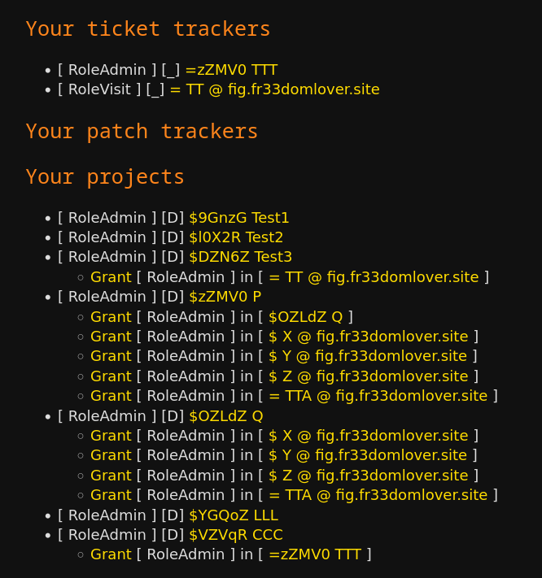

+++
title = "Happy Families - Project Nesting"
date = 2024-04-28
[extra]
author = "Pere Lev"
+++

As always, my [task board][kanban] is available. I use the Vikunja app to track
my work, it's not a static page and requires JS. And sometimes can be a bit
buggy and needs a reload.

You know what? Let me just show you.

## Nesting

I haven't used GitLab lately, and I don't use GitHub (other than for examining
its UI). But unless some huge change happened, that I missed, the following
features are probably still there:

- On GitLab, projects can be nested, a bit like a folder tree
- On GitHub, there's the "organization" concept, which can gather multiple
  projects and their access rules in one place

One of the federated tools ForgeFed provides, to allow projects to remain
organized and efficient as they grow, and to make the familiar nesting
available to forges that want to implement federation, is **project nesting**.

A project, in the ForgeFed sense, is a set of software development tools,
called **components**. The 3 fundamental components ForgeFed currently
describes are Repository (for storing code), Ticket Tracker (for opening
issues) and Patch Tracker (for opening PRs).

Speaking of components - if you could choose the 4th component ForgeFed will
support, what would you choose? Wiki, releases, CI, kanban board... I suppose
it would be one of those? I wonder which one would have the most impact! Let me
know on the Fediverse? :-) I think right now my tendency is towards CI (it
might be the most difficult to implement, but also an extremely useful and
common tool projects use, including ForgeFed itself, whose website (this
website you're looking at right now) is deployed using Codeberg's CI).

Thanks to federation, project nesting is quite flexible:

- Project *A* can become a parent of another project *B*
- *A* and *B* can reside on different servers, and it just works
- A project can have more than one parent!
- In other words, it's not a folder tree, but more like a directed graph
- There's a mechanism for preventing cycles, don't worry (but if you feel like
  testing it, see below for live demo links!)

I'm really curious if this flexibility can, when the time comes, support a
global decentralized network of forges, where projects can belong to multiple
contexts simultanously, and where federated access control and collaboration
are done really smoothly.

## Nesting and Access Control

Like on GitLab and GitHub, gathering projects together under higher-level
projects isn't just for visual convenience, it's also a powerful tool for
managing **access control**. If Alice obtains access to a project *CoolApp*,
she now automatically gains access to all the components of *CoolApp*, and to
the child projects of *CoolApp*, and to their own components and child
projects, and so on.

So, when people or teams are given responsibility on a certain group of
projects, an easy way to manage access is to put those projects under one big
parent project, and assign access through this parent project.

How does this automatic nested access control work?

Like almost everything around here, it uses ForgeFed's federated Object
Capability system! Here's an example:

- I create a project *A*
- I now receive a *Grant* activity, giving me access to *A*
- I create a project *B*
- I now receive a *Grant* activity, giving me access to *B*
- I make project *B* a child of project *A*
- Project *B* now passes a special *Grant* activity to *A*, and *A* passes it
  to me

Now I have 2 authorization paths for manipulating project *B*:

- The *Grant* that *B* gave me directly when I created it
- The *Grant*-for-access-*B* that *B* passed to *A*, and *A* passed to me
  because of my access to *A*

Is this confusing already? The story continues:

- I now create a ticket tracker *TT*
- I now receive a *Grant* activity, giving me access to *TT*
- I now add *TT* to be a component of project *B*

What happens now?

- *TT* passes a *Grant* to *B*
- *B* extends it to me, due to my direct access to *B*
- *B* also extends it to *A*, its parent project
- *A* further extends it to me, due to my direct access to *A*

I now have 3 *Grant*s for accessing *TT*!

- The direct one I got when I just created *TT*
- The one I got through *B*
- The one I got through *A*

It's now possible to *remove* me from having direct access to *B* and to *TT*,
and I'll still be able to manipulate them, because project *A* is extending me
access-to-them.

Here's my (somewhat cryptic) project overview on the [grape][] demo instance.
The items on the list are projects I have access to, and the sublists represent
*Grant*s that these projects have extended to me.

Items starting with `$` are projects. Items starting with `=` are ticket
trackers.

Another way to observe my Grants is to browse to some resource, such as a
ticket tracker or project or team, and if I have any Grants to access it, a "My
access" section will appear, like this:

So we're looking at this ticket tracker *TTT*, to which I have both direct
access (which in this case I got when I created it), and I have another Grant
that I received via some project *CCC*, because *TTT* is a component of *CCC*
and I'm a direct collaborator in *CCC*.

What's special about both views above is that their data is tracked by the
Person actor, not by the projects. It really makes things more convenient,
especially as more and more pieces are implemented and the system is getting
complex. Obviously this whole UI is just PoC-level (while we're working on an
actual frontend application). But I hope you'll see in the demo, how much
easier it makes things. Compared to the bare-bones forms and JSON objects I've
been playing with until now, this is a major convenience upgrade :P

I implemented those UIs primarily in the following commits:

- [DB: Add a Resource table, and use it in all local Actors except Person](https://codeberg.org/ForgeFed/Vervis/commit/acdce58fc614397bb5a9370b130cd53b73f06711)
- [DB: Permit: Use Resource instead of Actor in extension resource](https://codeberg.org/ForgeFed/Vervis/commit/48811545797a84a0bd79b6d3bbab7d415d0c13f3)
- [DB: Switch Collab and Permit to use Resource](https://codeberg.org/ForgeFed/Vervis/commit/888a30e989d0e2bba8ba2201b9f682b417d75a1a)
- [UI: Personal Overview: Display info of received permits, not just the Grant URI](https://codeberg.org/ForgeFed/Vervis/commit/dae57c394da2f74101703a3af423a29403c93a3c)
- [S2S: Person: Grant: Record role and resource in Permit record](https://codeberg.org/ForgeFed/Vervis/commit/ab08e593efa3f2e9e98673c36badd93b952b2a4d)
- [UI: When logged in, display my delegated access to a given local resource](https://codeberg.org/ForgeFed/Vervis/commit/fc9d56dd34369b2f6bfe62a3dbf6c58b77f47f7a)
- [UI: In my-grants-for-given-resource display, list direct grants as well](https://codeberg.org/ForgeFed/Vervis/commit/07d9f9adabe511357eeb707896d842df6521d8dc)

## Nesting implementation

By far the most complicated part of the implementation is the actual logic,
i.e. the Server-to-server (S2S) activity handlers that implement the activity
sequences that create and remove the links between children and parents. The
child-parent link, perhaps like in real life, is the most complex piece of the
OCAP system that I've implemented so far.

Here's the update to the specification, which describes both linking and
unlinking of parents and children, both for projects and for teams:

- [Spec: Describe adding/removing parents/children to/from teams and projects](https://codeberg.org/ForgeFed/ForgeFed/pulls/217)

The process of forming a child-parent link involves several activity types:
Add, Accept and Grant. And there are 4 different modes:

- Child-active: I'm getting a new child, and I'm initiating the process,
  waiting for the child to approve
- Child-passive: I'm getting a new child, but the child is the one initiating,
  now waiting for me to approve
- Parent-active: I'm getting a new parent, and I'm initiating the process,
  waiting for the parent to approve
- Parent-passive: I'm getting a new parent, but the parent is the one
  initiating, now waiting for me to approve

If I'm in child-active mode, then the child is in parent-passive. And if I'm in
child-passive mode, then the child is in parent-active. So these modes must
really dance together. Commits:

- [Vocab: Expand Remove activity parsing in preparation for child/parent mode](https://codeberg.org/ForgeFed/Vervis/commit/a1df4b3bdbb688ae22a009a78b838d8469ffa545)
- [UI, Vocab: Link from project/team to children & parents pages](https://codeberg.org/ForgeFed/Vervis/commit/ab786eb67cafd0061936eb2c161f96a94cd8a34d)
- [DB tables for project/team parent/child tracking](https://codeberg.org/ForgeFed/Vervis/commit/1f06d689f58d7e5133f59e89c43acd36165edba6)
- [S2S: Project: Add: Handle adding a child/parent; also update C2S Add](https://codeberg.org/ForgeFed/Vervis/commit/bce8079cb5f3b8a328561a19bf4e470c999c7bef)
- [S2S: Project: Accept: Implement child/parent mode](https://codeberg.org/ForgeFed/Vervis/commit/bdce87cf766a768df19a39bf4018722c49149aa4)
- [S2S: Project: Grant: Child/parent delegation when adding collab/component](https://codeberg.org/ForgeFed/Vervis/commit/3570d502cbe53a7c5066ed6866b8f563cc5f3156)
- [S2S: Project: Grant: Implement child mode](https://codeberg.org/ForgeFed/Vervis/commit/1d13d7a5513c038228ba78f6fe3b196b8bf13ca5)
- [S2S: Project: Grant: Implement parent mode](https://codeberg.org/ForgeFed/Vervis/commit/1c10d3fb0394f21e48b422fd1e6efefd96b6171a)
- [S2S: Project: Grant: When getting a new parent, send them a start-Grant](https://codeberg.org/ForgeFed/Vervis/commit/692c34bdec16b2c4c0a75b9fad0187bd15bcccab)

It was a huge piece of work! But it's just the logic, without UI around it, so
it was still invisible.

## Loop prevention

What if:

- Project A becomes a parent of project B
- Project B becomes a parent of project C
- Project C now becomes a parent of project... A?

Actually, the circular relationship itself isn't the problem. The problem is
that once it is formed, these project would start to send and extend Grants.
And if they aren't careful, they might end up extendind and extending the same
Grant chain infinitely, getting their CPUs and DBs and network connections busy
with this empty work. Also known as an accidental (or intentional) DDOS attack.
How to prevent this?

My first naive thought was: If I'm a project and about to add a child/parent,
What if I loop over the children/parents, and recursively their own
children/parents, to make sure I don't find myself somewhere in there? If I do,
it's a sign I can't add the child/parent, overwise I'd create a circular
situation. Thoughts?

This *might* work, but:

- It's very wasteful because of how it fans out, and can very quickly end up
  having to traverse tons of projects
- It's not really effective at preventine a DDOS attack, because regardless of
  who a project *claims* its children and parents are, it might make entirely
  different choices where to extend the Grant chains
- In other words, the chain is what matters here, not the public data of the
  parent-child links (i.e. a malicious of buggy project's talk and walk might
  differ)

So I went for a different approach, using the Grant chain itself:

- When I'm about to extend a chain, traverse the chain back to the beginning,
  making sure I don't appear there

Since the chain is a list, there's no fanning out! In computer science speak,
while the naive approach was *O(n)*, the new one is *O(log n)*, where *n* is
the amount of projects in the project graph.

But naively traversing the chain also creates a risk of DDOS: What if a
malicious (or buggy) project sends me a really, really long chain? Like, with a
million items?

The chain length corresponds to the number of Project nesting levels. While
theoretically it's arbitary, in practice even the biggest projects probably
need just a few levels of nesting. I expect that 4 is really enough for nearly
all projects, even the bigger ones. But perhaps really big projects need a bit
more. Since the numbers are so small, why don't we give them a comfortable
margin, just in case?

So, I added a new settings in the Vervis settings file: The maximal depth that
a Grant chain is allowed to have. A chain bigger than this is immediately
considered invalid. I set the default limit to 16, which is also what the 3
demo instances are using. But even if it was 100, which is probably more than
anyone out there ever needs, it's still way way less than a million.

So, this is the mechanism that prevents loops:

1. Traverse the chain before extending
2. Verify the length is below the maximum (default is 16)
3. Verify none of the Grants in the chain is mine

Commits:

- [S2S: Enforce max chain length when verifying OCAPs](https://codeberg.org/ForgeFed/Vervis/commit/6dd6dc17e532f611ac3d9e42e0dcaa8125a3e623)
- [S2S: Project: Grant: Before extending a Grant, test to avoid infinite loop](https://codeberg.org/ForgeFed/Vervis/commit/789411f5d2f9df0097fc7527978251e15ff89fba)

## Basic UI

So far, all of this is logic behind the scenes. I started adding the most basic
UI, forms that require copying and pasting URIs. I always add them anyway,
because I need them for flexibly testing federated interactions, but I usually
add the nice buttons first. This time, I started with the forms, so that the
behind-the-scenes mechanisms are visible, before I cover them with more
convenient UI.

I also added UI for viewing parents and children of a project.

- [UI, AP: Display project and team children and parents](https://codeberg.org/ForgeFed/Vervis/commit/802df6b15b43c61a01157ccc2772b83a23dc3543)
- [UI: Project: Children: Display child invites, their details & status](https://codeberg.org/ForgeFed/Vervis/commit/d32da785b85ebde791eb8323148c93be1c7a1167)
- [UI: Project: Parents: Display parent invite info & status](https://codeberg.org/ForgeFed/Vervis/commit/b80d897e0c8037ebc35a76f6eb190c3e20de3022)
- [UI, Client: Forms for adding and accepting a parent or child](https://codeberg.org/ForgeFed/Vervis/commit/992e17f1ca5f746f97082c718ee6df40c5a01d7c)
- [UI: Browse: List project's enabled children](https://codeberg.org/ForgeFed/Vervis/commit/0b08a7692ae1bc290e10d0cab0568b864326a4c2)

Viewing per project:

Viewing projects on an instance:

Adding a child-parent link:

I tested my implementation using this UI, both local and federated. Copying and
pasting URIs is of course quite annoying, but it allows to see how things work
behind the scenes. See video demo below.

## Link removal

Since Vervis has been mostly in PoC stage, and since the code evolves very
quickly and it's nice to have flexibility, and since I'm me, so far I've mostly
focused on code that *creates* stuff, and much less on code that *deletes*
stuff. I think I never properly implemented things like deleting a user
account, or deleting a ticket tracker. I mean, I did at some point, but then
big changes to the code broke those features, and it was really difficult to
maintain them, especially considering the low priority.

But now that the Anvil frontend is on its way, and Vervis is getting more and
more core features implemented, I really hope to catch up and make it possible
to delete things properly, as well as edit, and at some point also freely and
easily migrate data between servers (for which I hope to use the F3
specification, on which my Forge Federation colleagues Earl Warren and Loic
Dachary have been working for some time now, and I'm excited to integrate with
that).

The child-parent link removal process was much easier to implement than the
link creation process, but it simiarly involves multiple types of activities:
Remove, Accept, Revoke.

Commits that implement the logic:

- [S2S: Project: Remove: Implement child/parent mode](https://codeberg.org/ForgeFed/Vervis/commit/048c429def90ef29bf0ddc1b0a63c50d087df282)
- [S2S: Project: Accept: Implement remove-child mode](https://codeberg.org/ForgeFed/Vervis/commit/223fbf3d0eb928ecbb0967157ca2e98563983df5)
- [S2S: Project: Revoke: Handle parent revoking the delegator-Grant](https://codeberg.org/ForgeFed/Vervis/commit/a16fb6cd193e6137aa8ee8ac63b3bca84bb6b59a)
- [S2S: Project: Revoke: Handle child revoking one of the Grants they sent me](https://codeberg.org/ForgeFed/Vervis/commit/24aba4d370487b24a2cb89ddd3218e3eae640aa8)

And UI, a form similar to the ones above:

- [UI: Removal form: Extend to work on children/parents as well](https://codeberg.org/ForgeFed/Vervis/commit/1f36657084cc3ace783ecaa6df423a68eee50b23)

## More convenient UI

With all those pieces in place, I really wanted to feel the ease of just
clicking stuff without having to manually choose which Grant activity to use
for authorization, and pasting around all these URIs.

What if I browse to project A, and there's a little box where I just paste the
URI of project B (since there's no JS-powered search yet, that's the minimum to
paste) and click "Add"? And then the other side approves the child-parent link
using a button, without any pasting? And what if parent/child removal is a
single button click too?

So, I decided to implement these things:

- [UI: Project: Provide buttons for removing children](https://codeberg.org/ForgeFed/Vervis/commit/abefcbd310031d4fdb5acfbc1f7578e0943855aa)
- [UI: Project: Buttons for removing parents](https://codeberg.org/ForgeFed/Vervis/commit/bb1685f695f051aeefb8176d53bb3c7b42e7018c)
- [UI: Project: Children: Form for adding a child](https://codeberg.org/ForgeFed/Vervis/commit/d9d6b9fcedbd2022fe0118fec6f0fa66e2cda28e)
- [UI: Project: Children: Button for approving the Add](https://codeberg.org/ForgeFed/Vervis/commit/082eae7a51e411a911ff216da11957be2b46f5dd)
- [UI: Project: Parents: Form for adding a parent by URI](https://codeberg.org/ForgeFed/Vervis/commit/99f6d950a203e00a073e039b764c011fdaa6eec0)
- [UI: Project: Parents: Button for approving a parent](https://codeberg.org/ForgeFed/Vervis/commit/ef036fd08b3ba4ea0a64d999baddc866b14ed9ae)

Adding a child:

Now the project displays the invited child:

If we browse to the child's parents page, we can see the invite there too, and
since I have admin access to the child, there's an *Approve* button:

Voila! The child-parent link is now enabled, and there's a *Remove* button to
disable it:

## Funding

I really want to thank NLnet for funding this work, and much more to come! My
grant (which just expired) is going to be extended, and
[André](https://jaenis.ch)'s work on the Anvil frontend is going to be funded
too.

## See It in Action

I recorded a little demo of all this! [Watch it on my PeerTube
instance](https://tube.towards.vision/w/7q5UdESQatoWYKvG1xeSAo).

If you want to play with things yourself, you can create account(s) on the demo
instances - [fig][], [grape][], [walnut][] - and try the things I've mentioned
and done in the video.

If you encounter any bugs, let me know! Or [open an
issue](https://codeberg.org/ForgeFed/Vervis/issues)

## Comments

Come chat with us on
[Matrix](https://matrix.to/#/#general-forgefed:matrix.batsense.net)!

And we have an account for ForgeFed on the Fediverse:
<https://floss.social/@forgefed>

Right after publishing this post, I'll make a toot there to announce the post,
and you can comment there :)

[kanban]: https://todo.towards.vision/share/lecNDaQoibybOInClIvtXhEIFjChkDpgahQaDlmi/auth?view=kanban
[Vervis]: https://codeberg.org/ForgeFed/Vervis
[fig]: https://fig.fr33domlover.site
[grape]: https://grape.fr33domlover.site
[walnut]: https://walnut.fr33domlover.site
