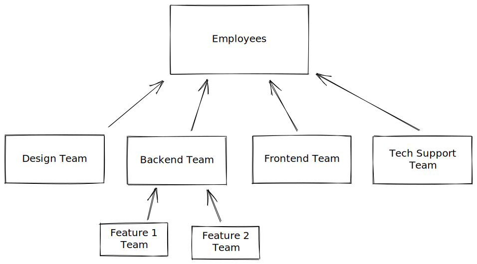

+++
title = "Team Nesting"
date = 2024-05-17
[extra]
author = "Pere Lev"
+++

The previous post was about project nesting. Most of what I said there probably
applies to team nesting as well, and the implementation of team nesting reuses
the same mechanism. The *next* step, connecting teams and projects, is going to
be big. But today I'll talk about this in-between step: Team nesting.

As always, my [task board][kanban] is available!

## Organizational Structure

Every organization has systems for how collaboration and communication works.
Sometimes these are conscious systems, explicitly defined. And sometimes
they're implicit. When these systems aren't defined and discussed, what
probably often happens is that our old habits and cultural conditioning take
the stage. So, whether we're aware of it or not, the systems are there.

Some of these systems are:

- Resource flow: How do resources (money, equipment, support, working hands,
  etc. etc.) flow within the organization, and into it and out of it? Which
  mechanisms control that?
- Decision making: Who makes decisions on what, and using which methods?
- Feedback flow: When, where and how is feedback given between people and teams
  in the organization, and how is it integrated? Which mechanisms support
  people's growth and an evolution of the organization's vision, purpose and
  strategies?
- Conflict engagement: How are conflicts dealt with?
- Information flow: How does information flow within the organization, who
  knows what and why and how?
- Care and support: When people and teams have personal or relational needs
  that affect their capacity with respect to the organization's purpose, how
  are those needs attended, how are difficulties supported?

I was actually going to do a remote workshop on LibrePlanet about this :-) I
guess they had more relevant candidates for the remote slots. Anyway, I'm
inviting you to examine your software projects, and organizations you're in,
through this lens of organizational systems! How do these things work in your
team or project?

I have a dream, a fantasy: A sofware forge that provides effective tools and
guidance for managing all these aspects, not just the plain usual
code-issues-PRs structure. For example, enhance the typical stream-of-comments
issue tracker to include a powerful decision-making tracker system. If you're
up for the challenge of designing and implementing such things, I'm up for
offering my guidance and consulting :-)

For now, the focus of ForgeFed is simply modeling the basic tools that
developers usually expect from a forge, and that the popular forges offer.
Therefore, "organizational structure" in ForgeFed is primarily within the
resource flow department, specifically **access control**: The system that
determines who has which access to which resources.

So, if your organization has 5 teams, all of them working on the same piece of
software and all having the same full access to the code, there might be no
need, in the ForgeFed sense, to create 5 *Team*s. Because the primary
contribution of creating teams, I believe much like in the common centralized
forges, is to define access control.

## Team Nesting for Access Control

So how do we define access control using ForgeFed's team nesting? A previous
blog post already discussed teams, so I'm focusing here on the new feature: The
ability to *nest* teams, i.e. teams having subteams / child teams. Here's an
example of what it might look like:

So, *Employees* is a team that's going to have access to the common resources
that everyone in the organization uses. Then there's some subteams, which:

1. Have access to their own resources, which aren't avilable for the rest of
   the organization (e.g. perhaps the backend team has its own code
   repostories)
2. Inherit the access that their parent teams have, e.g. people in the
   *Backend* team automatically gain access to whatever the *Employees* team
   has access to!
3. Further pass both of these to their own subteams

Creating teams, and forming parent-child relationships, are separate actions in
ForgeFed. In a federated network, there's no hierarchy with someone at the top
who controls everything. So, cooperation between actors is based on **mutual
consent**. From the ForgeFed perspective, *Employees* and *Backend Team* are
just two independent self-contained *Team* actors, that have decided to form a
parent-child link between them. Neither of them can force the other to
cooperate: It works only as long as mutual consent exists.

However, representing hierarchical team structures with ForgeFed is entirely
possible. Here are some ideas:

- Create a *Managers* team that is a child of all other teams
- Create an *Everything* project that is a parent of all projects in the
  organization, and give managers access to this project

The mechanism for forming and removing team parent-child links is similar to
the mechanism for projects:

- A human approves the link from one side
- A human approves the link from the other side
- Both teams approve the link AKA handshake
- Child team tells the parent "Okay, you can extend access tokens to me"
- Parent team, when it receives access tokens (AKA *Grant* activities), sends
  extensions to the child

## Implementation

Much of this was already implemented while working on project nesting. So what
remained is to adapt the code from projects, and reuse the common pieces:

- [UI: Group: Implement parent/child process button POST handlers](https://codeberg.org/ForgeFed/Vervis/commit/533fc60fe1c867592b8d8dc0911477ccad7c5ae1)
- [UI: Group: Display parent and child invites & approve-remove buttons](https://codeberg.org/ForgeFed/Vervis/commit/74af2ea2232e101d70656cc11392ec1f6c06253d)
- [UI: Browse: List team parents](https://codeberg.org/ForgeFed/Vervis/commit/bef8a77d8446932b7cfc9659405bdee8bbd841d5)
- [S2S: Group: Implement Add handler based on Project](https://codeberg.org/ForgeFed/Vervis/commit/3162a6ac28b3287b3d65bccac00617f95438f000)
- [S2S: Project: Accept: Separate child and parent modes' code](https://codeberg.org/ForgeFed/Vervis/commit/ee30cb9f70dddb81e8625480cc1376cce22cc94f)
- [S2S: Group: Accept: Port child-parent modes from Project](https://codeberg.org/ForgeFed/Vervis/commit/d72e06727c912470ed7402a3ecd3be8d889ba0f5)
- [S2S: Group: Grant: Port parent-child modes from Project](https://codeberg.org/ForgeFed/Vervis/commit/5e0a2e1088b2f24049fd63d4b8e2ff5a6f4f1baa)
- [S2S: Group: Remove: Port parent-child modes from Project](https://codeberg.org/ForgeFed/Vervis/commit/1e69a6e952055b0b044ba2a9b138eb97e4d5ca3a)
- [S2S: Group: Port Revoke handler from Project](https://codeberg.org/ForgeFed/Vervis/commit/6cb1c11141e6bb1ce5a6fee9c53ab843c8fb6c91)

## Funding

I really want to thank NLnet for funding this work, and much more to come! My
grant has been extended, which allows me to continue :-)

## Next Steps

I'm so excited about the next piece! The extended and updated grant from NLnet
is allowing me to work on project-team links, and more generally
**team-resource** links. In other words, much like *Person*s can be
collaborators on resources, *Team*s will be able to be collaborators too. And
that task, which is already in progress, will complete the OCAP system vision
that's been forming for the past few years!

Some of the next challenges I see ahead:

- Fixing and completing all the basic features: Registration API, commenting,
  PR merging, git-push by remote collaborators, resource and account deletion,
  editable settings for all resources, probably a few more bits
- Turning Vervis into a beyond-PoC stable usable forge, in particular the actor
  logic, since the UI is going to be replaced
- Figuring out if and how existing forges can implement federation, e.g.
  Forgejo and GitLab
- Implementing a fully functional usable frontend application (this is in
  progress!)
- Figuring out how to deploy a federated forge network, in particular the
  human/social aspect of it, e.g. how to avoid the formation of few huge
  company-owned instances where everyone is lured to flock, and how to form a
  (probably international) team that will maintain and further develop the
  software that powers the network *(I'm imagining all the eyes looking at me)*

## See It in Action

I recorded a little demo of all this! [Watch it on my PeerTube
instance](https://tube.towards.vision/w/rPriJtLe216Y22sZtnaRVT).

If you want to play with things yourself, you can create account(s) on the demo
instances - [fig][], [grape][], [walnut][] - and try the things I've mentioned
and done in the video.

If you encounter any bugs, let me know! Or [open an
issue](https://codeberg.org/ForgeFed/Vervis/issues)

## Comments

Come chat with us on
[Matrix](https://matrix.to/#/#general-forgefed:matrix.batsense.net)!

And we have an account for ForgeFed on the Fediverse:
<https://floss.social/@forgefed>

Right after publishing this post, I'll make a toot there to announce the post,
and you can comment there :)

[kanban]: https://todo.towards.vision/share/lecNDaQoibybOInClIvtXhEIFjChkDpgahQaDlmi/auth?view=kanban
[Vervis]: https://codeberg.org/ForgeFed/Vervis
[fig]: https://fig.fr33domlover.site
[grape]: https://grape.fr33domlover.site
[walnut]: https://walnut.fr33domlover.site
