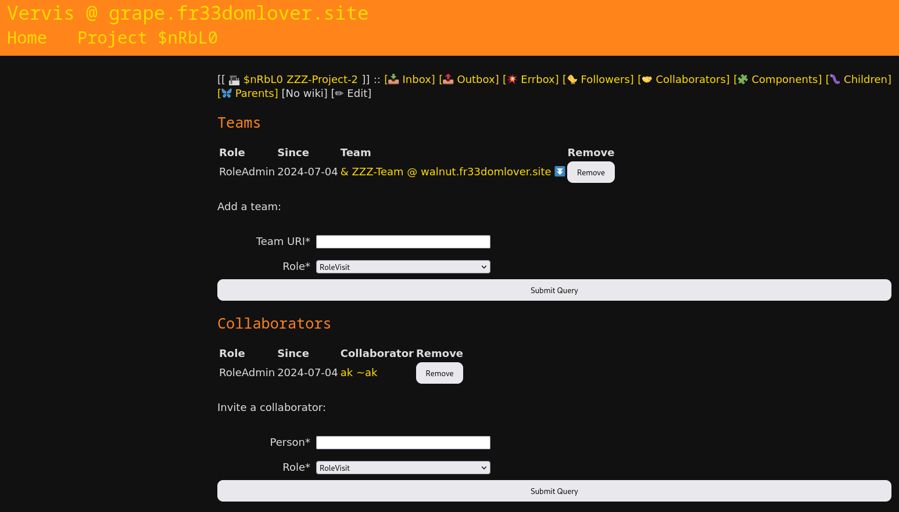
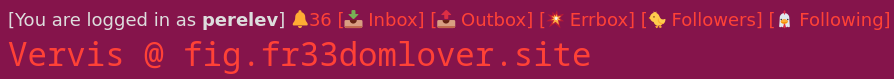
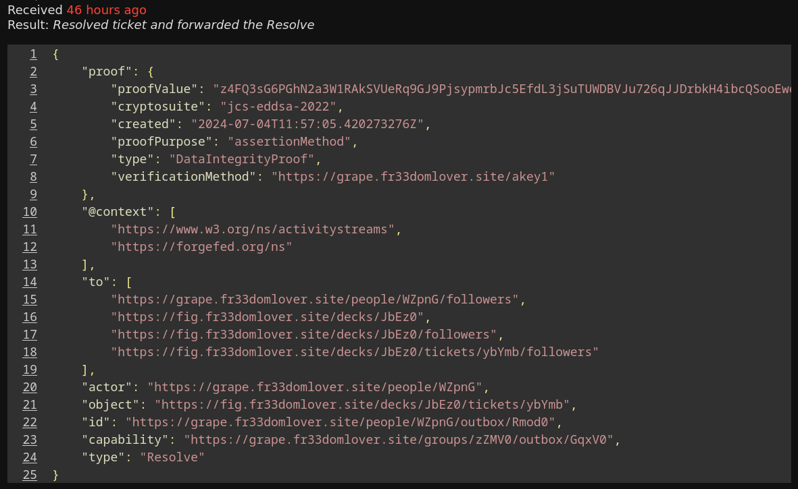
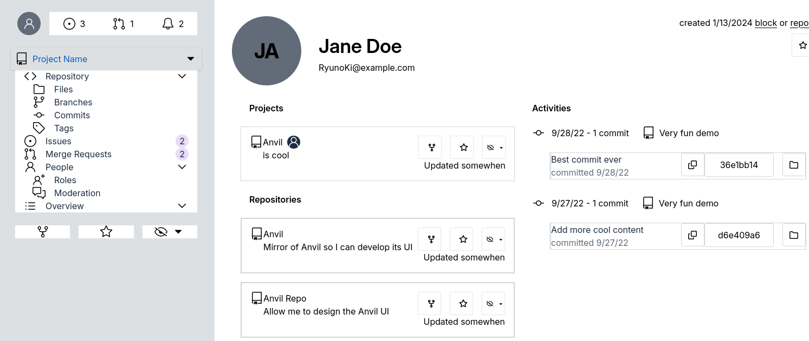

+++
title = "Team-Resource Links"
date = 2024-07-14
[extra]
author = "Pere Lev"
+++

The previous posts described project nesting and team nesting. So at that
point, it was possible to:

- Create projects with components in them
- Create project hierarchies
- Create teams
- Create team hierarchies
- Add collaborators/members to projects/components/teams

There are still details to polish, of course (e.g. how to link a `Repository`
with its `PatchTracker`), but the core authorization system has been missing
one final piece: **Adding teams as collaborators in projects and components**.
This piece is now implemented! All the exciting info is below, including a demo.

As always, my [task board][kanban] is available.

## Collaboration via Teams

The main purpose of gathering people in `Team` actors is to make access control
easier: You create a `Backend` team and give this team access to the
backend-related repositories and resources.

Before, we were forming child-parent links between projects, and then between
teams. Now there's a new kind of link, in which:

- One side is a `Team` actor
- The other side is some resource actor, that isn't a `Team`

The resource actors mentioned in the ForgeFed specification (and implemented in
Vervis) are:

- `Project`
- The 3 component types: `Repository`, `TicketTracker`, `PatchTracker`

So these resources can now, in addition to regular `Person` collaborators, have
`Team` collaborators, via the new kind of link.

Team-resource links are created and removed using a mutual-consent process very
similar to how parent-child links work, so I won't go into the technical
details. See the previous posts for those.

In the UI, here's where I placed team-resource links:

- For teams, there's now a *Projects* tab (which I'll probably rename to
  *Resources*)
- For resources, under the existing *Collaborators* tab there's a teams section

## Bonus: Inbox Debug Reports

Vervis has had some UI for examining the activities received in actor inboxes,
and the results of their processing, but this feature was very lacking. In
particular:

- Only error messages are shown, while successful processing results aren't
- Only S2S remote activities are shown, on a per-instance page, i.e. local
  activity results aren't displayed anywhere and actors don't have their own
  per-actor debug reports
- Activity reports are stored in-memory, which means they disappear when Vervis
  is restarted

The debug report system recently got an upgrade!

- Actors have their own "errbox", i.e. an inbox displaying activities whose
  processing resulted with an error
- Actor inbox display shows processing results, whether it's error or success
- The per-instance federated report page grabs activities from the DB, so they
  don't disappear when Vervis is restarted

This upgrade made my life so much easier, during the work on parent-child and
team-resource links.

"Errbox" link for every actor:

Inbox item, including processing result:

## Implementation

I started from the DB, UI and API parts, and left the sweet actual S2S
implementation for the end. While working on this task, I also polished, fixed
and added missing bits for project-component links, which made this task take
longer than I hoped (but those bits were important).

The OCAP implementation for components is reusable, but right now only
`TicketTracker` is using it. `Repository` and `PatchTracker` are temporarily
out of the game for now, because I want to figure out the details of linking
them together, as well as the mechanisms for federated-OCAP git-push. Then,
when I see the bigger picture, I'll wire in these components as well. Want to
join the brainstorming on this? [Comment on the
issue](https://codeberg.org/ForgeFed/ForgeFed/issues/226) <3

Team-resource links:

- Specification
  - [Define process of adding and removing a team-resource link](https://codeberg.org/ForgeFed/ForgeFed/pulls/220)
- DB
  - [DB: Add tables for team-resource link tracking](https://codeberg.org/ForgeFed/Vervis/commit/d23144e2c402058e5b24b0505100b3422ef5d51f)
  - [DB: Add tables for tracking project extending delegations to teams](https://codeberg.org/ForgeFed/Vervis/commit/46cb13e5b05a0b3ecd5222d7a48cb4a43b59f40e)
- Vocabulary, serving AP data & UI
  - [Vocab, UI: Component: Specify and serve teams collection](https://codeberg.org/ForgeFed/Vervis/commit/6de8ce6b2585040954288d7da496ec18b1da725b)
  - [UI: Component: POST handlers for team add/approve/remove buttons](https://codeberg.org/ForgeFed/Vervis/commit/7ade4984d799ab9ab8f80172e18909d6c6a69ca7)
  - [UI: Deck, Group, Project: Enhance collaborators view, prepare to add teams](https://codeberg.org/ForgeFed/Vervis/commit/5c6e73a3d422435ccaa75f3ce5ee2d980e571bc2)
  - [UI: Repo, Loom: Update collaborators view & buttons, similar to Deck](https://codeberg.org/ForgeFed/Vervis/commit/97dee05af80d88c2b66b6cf792c78d74620636a2)
  - [UI: Component, Project: Display teams, invites and action buttons](https://codeberg.org/ForgeFed/Vervis/commit/0ee94afd9e98339972c860c86fe4be633d5d4007)
  - [UI, Vocab: Group: Serve accessible resources collection](https://codeberg.org/ForgeFed/Vervis/commit/f93f67a098c11d638f926552c16c4da038000292)
  - [UI: Group: POST handlers for resource add-approve-remove buttons](https://codeberg.org/ForgeFed/Vervis/commit/e542c7d53120103528f6b50ae4b4f132c5723362)
  - [UI: Group: Display resources, invites and action buttons](https://codeberg.org/ForgeFed/Vervis/commit/3e110ca53c38a79a24013e6bb7a9bfe7226ff17e)
  - [Serve live URIs for Team (Squad) records for project, repo, deck, loom](https://codeberg.org/ForgeFed/Vervis/commit/4f5954de7edf12f924324dbc641c0cdf066bd415)
  - [UI: Repo, Loom: Project add-approve-remove buttons](https://codeberg.org/ForgeFed/Vervis/commit/fe7ae763db6e9c2f3a9a2e41de26606dfe72f08e)
  - [Serve AP version of component projects collection](https://codeberg.org/ForgeFed/Vervis/commit/26ace5f9b8210ff0f494e74e1f90aa04d69db27b)
- S2S logic for Team)
  - [S2S: Group: Grant: Extend Grants from my projects](https://codeberg.org/ForgeFed/Vervis/commit/4838a131b427d05e5882c03be26e5931396baea3)
  - [S2S: Group: Add: Implement resource-active mode](https://codeberg.org/ForgeFed/Vervis/commit/f7d3d6d9577c653e6fcb9729d1a70fa129ae6ec0)
  - [S2S: Group: Add: Implement resource-passive mode](https://codeberg.org/ForgeFed/Vervis/commit/83590ba6ff54a456066d536da4f40fe47b1341dc)
  - [S2S: Group: Accept: Implement resource mode](https://codeberg.org/ForgeFed/Vervis/commit/cd18217f08fbbd402c8cdf3357232634ca65b5f2)
  - [S2S: Group: Accept: Implement remove-resource mode](https://codeberg.org/ForgeFed/Vervis/commit/c385dad10b7127093e65e3990821a756d53d8030)
  - [S2S: Group: Grant: Implement resource mode](https://codeberg.org/ForgeFed/Vervis/commit/a36eda1e2b43e6db8457099d6e750225bdfbf494)
  - [S2S: Group: Remove: Implement resource-active mode](https://codeberg.org/ForgeFed/Vervis/commit/9df437a043f3717f465f099b480500031c435127)
  - [S2S: Group: Remove: Implement resource-passive mode](https://codeberg.org/ForgeFed/Vervis/commit/4d37d1293a021b1fa1b450703b3b6e6955345d89)
  - [S2S: Group: Revoke: Implement resource mode](https://codeberg.org/ForgeFed/Vervis/commit/5d88036fc39cb4bf582116deca2e03f0d0add1ab)
- S2S logic for Project and components
  - [S2S: Project: Revoke: Implement component & team modes](https://codeberg.org/ForgeFed/Vervis/commit/646e17fa5672a101194e7109d425db57e50b42ff)
  - [S2S: Project: Accept: When removing a child, revoke extensions to teams](https://codeberg.org/ForgeFed/Vervis/commit/3fb5e92f4407f754f962ae56a0f43aace4bbff8f)
  - [S2S: Project: Grant: When adding component/child, extend Grant to teams](https://codeberg.org/ForgeFed/Vervis/commit/14ff1b293f332384b3324c0a40e8f4f89702cd32)
  - [S2S: Project: Revoke: Collab: Delete and send Revokes on extensions](https://codeberg.org/ForgeFed/Vervis/commit/3afdfbf3d70b02109da015c16a7107f125980014)
  - [S2S: Project: Remove: Child-active: Revoke Grants-for-teams](https://codeberg.org/ForgeFed/Vervis/commit/7af44d693c06b16b95cb718383cc6a7c608309fa)
  - [S2S: Component: Implement Revoke handler](https://codeberg.org/ForgeFed/Vervis/commit/1bdd1e9e9b6f828370806d01ad3fd42da596a94f)
  - [S2S: Project: Add: Implement team mode](https://codeberg.org/ForgeFed/Vervis/commit/3c8b8dbc48e0a246dc2d5e13c66b27d0339f8eec)
  - [S2S: Project: Accept: Implement team mode](https://codeberg.org/ForgeFed/Vervis/commit/68141fa7da9650152b3189bd36e70c1c05e3bb41)
  - [S2S: Project: Grant: Implement team mode](https://codeberg.org/ForgeFed/Vervis/commit/3359974af7267ca3a7ad24e0debfdc1bbf3e67e8)
  - [S2S: Project: Remove: Implement team mode](https://codeberg.org/ForgeFed/Vervis/commit/7a5147aad9e2511c1d7ccaed5df3fe2b07899deb)
  - [S2S: Component: Add: Port team-mode from Project](https://codeberg.org/ForgeFed/Vervis/commit/cdd43292bc97c87144f0430323756e7e4e8b34fd)
  - [S2S: Component: Accept: Port team-mode from Project](https://codeberg.org/ForgeFed/Vervis/commit/40ab419946c51d69d830c4eb85e1d8dd42cab1e4)
  - [S2S: Component: Grant: Port team-mode from Project](https://codeberg.org/ForgeFed/Vervis/commit/02f46a21f97df030f9ba822fd107783dfb90ef49)
  - [S2S: Component: Remove: Port team-mode from Project](https://codeberg.org/ForgeFed/Vervis/commit/4d06d8e84005c72156e8bb3b8ca89f9b5bf849e6)

Inbox debug reports:

- [S2S, DB: Store processing result in InboxItem record](https://codeberg.org/ForgeFed/Vervis/commit/eef4c3f79ab520434c9c84625669d22a472942b4)
- [UI: Inbox: For each item, display the result of processing](https://codeberg.org/ForgeFed/Vervis/commit/b519bbe7b9c42a3e82d67b3e044bd8fee809aa9b)
- [DB: Give each actor a secondary inbox, for collecting errors](https://codeberg.org/ForgeFed/Vervis/commit/29e7581b19a13dcd7195da029a7c07487e9a2de7)
- [UI: Error-inbox ("Errbox") display for all local actors](https://codeberg.org/ForgeFed/Vervis/commit/a60b05b1cae4c0c7b95bf9f7afcec6a8d280355e)
- [UI, DB: Store debug reports in DB and link to them from navbar](https://codeberg.org/ForgeFed/Vervis/commit/9ce745c72586e4888936087aedf558e6b1e91262)

## Funding

I really want to thank NLnet for funding this work! The extended grant is
allowing me to continue backend work, and allowing André to work on the
[Anvil][] frontend.

## Next Steps

Meanwhile, the [Anvil][] frontend is making progress as well:

The previous blog post has a list of challenges waiting ahead. With the core
OCAP system complete, I'm now looking at the list of remaining funded tasks.
There's primarily 3 kinds of tasks:

- Documentation, API and bug-fixing, to support Anvil's development, and the
  deployment of a Vervis-Anvil federated forges
- Actor-programming library and demo (much more powerful than the current
  ActivityPub-based OCAPs, and I believe necessary for the growing federated
  ecosystem)
- Vervis core features for `Repository` and `PatchTracker`

The 2nd kind is the most difficult for me: Create a powerful type-safe
actor-programming library in the Haskell programming language. I already
started this, probably over a year ago, but haven't touched that work in a long
time. And it's quite advanced Haskell (at least for me). Luckily there's
already work by another NLnet-funded project, and the Haskell implementation of
Cap-n-Proto, which I hope to reuse.

In the coming months I hope to touch all of those tasks. But I'm not sure yet
how to divide my time and focus between them. I'm especially afraid to spend a
lot of time on the actor-programming library, and end up failing. I really need
the income right now, so working on safer tasks is easier. On the other hand,
much of my remaining funds are for the library. We'll see :)

## See It in Action

I recorded a little demo of all this! [Watch it on my PeerTube
instance](https://tube.towards.vision/w/hSJ9rSpB5aiduGboYuNJBj).

If you want to play with things yourself, you can create account(s) on the demo
instances - [fig][], [grape][], [walnut][] - and try the things I've mentioned
and done in the video.

If you encounter any bugs, let me know! Or [open an
issue](https://codeberg.org/ForgeFed/Vervis/issues)

## Comments

Come chat with us on
[Matrix](https://matrix.to/#/#general-forgefed:matrix.batsense.net)!

And we have an account for ForgeFed on the Fediverse:
<https://floss.social/@forgefed>

Right after publishing this post, I'll make a toot there to announce the post,
and you can comment there :)

[kanban]: https://todo.towards.vision/share/lecNDaQoibybOInClIvtXhEIFjChkDpgahQaDlmi/auth?view=kanban
[Vervis]: https://codeberg.org/ForgeFed/Vervis
[fig]: https://fig.fr33domlover.site
[grape]: https://grape.fr33domlover.site
[walnut]: https://walnut.fr33domlover.site
[Anvil]: https://codeberg.org/Anvil/Anvil
